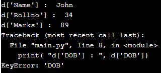

# Hash Tables

## What is a Hashtable? 

In python, the Hash table is a type of data structure that maps keys to its value pairs. It makes accessing data faster as the index value behaves as a key for data value.

- Hash - A hash is the result of some algorithm taking an incoming string and converting it into a value that could be used for either security or some other purpose. In the case of a hashtable, it is used to determine the index of the array.
- Buckets - A bucket is what is contained in each index of the array of the hashtable. Each index is a bucket. An index could potentially contain multiple key/value pairs if a collision occurs.
- Collisions - A collision is what happens when more than one key gets hashed to the same location of the hashtable.


## Why do we use them?
Hold unique values
Dictionary
Library

## What are the advantages of using hashtable in Python?
Hash tables have better performance when compared to other data structures. A dictionary data type in python is an example of a hash table. Hash tables support insert, search and delete operations. A null value cannot be used as an index value. Collisions cannot be avoided in hash functions.

## Can I use custom data types as hashtable keys in Python?
Until now, you’ve taken it for granted that most built-in types in Python can work as hash table keys. However, to use any hash table implementation in practice, you’ll have to restrict keys to only hashable types and understand the implications of doing so. That’ll be especially helpful when you decide to bring custom data types into the equation.

## Working of the hash table in python
The hash table in python can be created with the help of the dictionary, and the dictionary can be created by using the curly braces and dict() function. Suppose we have a dictionary of the student marks which contains the student marks. Now we need to update the student marks data, so we can perform as “Student_marks[56] = 65”, where Student_marks is the dictionary, and 56 is the key stored in the dictionary for the student of roll no 56. So it updates the marks value 65 for roll no 56

## Examples of the hash table in python

```
# declare and initialize the dictionary
d = { 'Name' : 'John', 'Rollno' : 34, 'Marks' : 89}
# Access the value of the dictionary with the key
print( "d['Name'] : ", d['Name'])
print( "d['Rollno'] : ", d['Rollno'])
print( "d['Marks'] : ", d['Marks'])
# passing the non-available key in the dictionary
print( "d['DOB'] : ", d['DOB'])
```


- An output of the above code is –


## Creating a Hash
A hashtable traditionally is created from an array. I always like the size 1024. this is important for index placement. After you have created your array of the appropriate size, do some sort of logic to turn that “key” into a numeric number value. Here is a possible suggestion:

1. Add or multiply all the ASCII values together.
2. Multiply it by a prime number such as 599.
3. Use modulo to get the remainder of the result, when divided by the total size of the array.
4. Insert into the array at that index.

## Basic of Hashing
- Hashing is a technique that is used to uniquely identify a specific object from a group of similar objects. Some examples of how hashing is used in our lives include:. In universities, each student is assigned a unique roll number that can be used to retrieve information about them.

In hashing, large keys are converted into small keys by using hash functions. The values are then stored in a data structure called hash table. Each element is assigned a key (converted key) and can be accessed in O(1) time. Using the key, the algorithm computes an index that suggests where an entry can be found or inserted.


