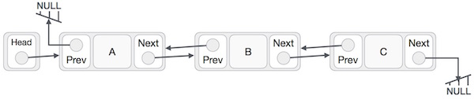

#Big O: Analysis of Algorithm Efficiency
Big O(oh) notation is used to describe the efficiency of an algorithm or function

- Running Time (also known as time efficiency / complexity)
The amount of time a function needs to complete

- Memory Space (also known as space efficiency / complexity)
The amount of memory resources a function uses to store data and instructions

Big O is a member of a family of notations invented by Paul Bachmann. The letter O stands for Ordnung, meaning the order of approximation. Big O notation is used to classify algorithms according to how their run time or space requirements grow as the input size grows.

In addition to the big O notations, another Landau symbol is used in mathematics: the
little o. Informally, f(x) = o(g(x)) means that f grows much slower than g and is
insignificant in comparison.
Formally, we write f(x) = o(g(x)) (for x ->soh) if and only if for every C>0 there exists a
real number N such that for all x > N we have |f(x)| < C |g(x)|; if g(x) 0, this is
equivalent to limxf(x)/g(x) = 0.
Also, if a is some real number, we write f(x) = o(g(x)) for x -> a if and only if for every
C>0 there exists a positive real number d such that for all x with |x - a| < d
we have |f(x)| < C |g(x)|; if g(x) 0, this is equivalent to limx -> a f(x)/g(x) = 0.

 Acommon error is to confuse these by using O when  is meant. For example, one might
say "heapsort is O(n log n)" when the intended meaning was "heapsort is (n log n)".
Both statements are true, but the latter is a stronger claim.
The notations described here are very useful. They are used for approximating formulas
for analysis of algorithms, and for the definitions of terms in complexity theory (e.g.
polynomial time).

# Linked List
A linked list is a linear data structure, in which the elements are not stored at contiguous memory locations.
A linked-list is a sequence of data structures which are connected together via links.

Linked List is a sequence of links which contains items. Each link contains a connection to another link. Linked list the second most used data structure after array. Following are important terms to understand the concepts of Linked List.

!.png)

## Types of Linked List
Following are the various flavours of linked list.

Simple Linked List − Item Navigation is forward only.

Doubly Linked List − Items can be navigated forward and backward way.

Circular Linked List − Last item contains link of the first element as next and and first element has link to last element as prev.

## Why Linked Lists?
Linked lists and arrays are similar since they both store collections of data. The
terminology is that arrays and linked lists store "elements" on behalf of "client" code. The
specific type of element is not important since essentially the same structure works to
store elements of any type. One way to think about linked lists is to look at how arrays
work and think about alternate approaches

## What Linked Lists Look Like
An array allocates memory for all its elements lumped together as one block of memory.
In contrast, a linked list allocates space for each element separately in its own block of
memory called a "linked list element" or "node". The list gets is overall structure by using
pointers to connect all its nodes together like the links in a chain.
Each node contains two fields: a "data" field to store whatever element type the list holds
for its client, and a "next" field which is a pointer used to link one node to the next node.
Each node is allocated in the heap with a call to malloc(), so the node memory continues
to exist until it is explicitly deallocated with a call to free(). The front of the list is a
5
pointer to the first node

##  Single linked list
Single linked list is a sequence of elements in which every element has link to its next element in the sequence.

The following operations are performed on a Single Linked List

Insertion
Deletion
Display

## Doubly Linked List

As per the above illustration, following are the important points to be considered.

Doubly Linked List contains a link element called first and last.

Each link carries a data field(s) and two link fields called next and prev.

Each link is linked with its next link using its next link.

Each link is linked with its previous link using its previous link.

The last link carries a link as null to mark the end of the list.

Basic Operations
Following are the basic operations supported by a list.

Insertion − Adds an element at the beginning of the list.

Deletion − Deletes an element at the beginning of  list.

Insert Last − Adds an element at the end of the list.