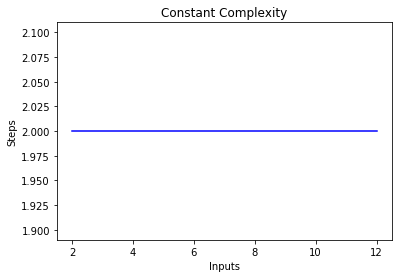

## Big O Notation and Algorithm Analysis with Python 

Big-O notation is a metrics used to find algorithm complexity. Basically, Big-O signifies the relationship between the input to the algorithm and the steps required to execute the algorithm. It is denoted by a big "O" followed by opening and closing parenthesis.

- The following are some of the most common Big-O functions:


| Name    | Big O|
|----------|:-------------:|
|Constant|	O(c)|
|Linear|	O(n)|
|Quadratic|	O(n^2)|
|Cubic|	O(n^3)|
|Exponential|O(2^n)|
|Logarithmic|O(log(n))
|Log Linear|O(nlog(n))

---

- Now  let's take a look at some examples of constant, linear, and quadratic complexity.

### Constant Complexity (O(C))

- Example 
```
def constant_algo(items):
    result = items[0] * items[0]
    print()

constant_algo([4, 5, 6, 8])
```
- Analysis 

If you draw a line plot with the varying size of the items input on the x-axis and the number of steps on the y-axis, you will get a straight line. To visualize this, execute the following script:

```
import matplotlib.pyplot as plt
import numpy as np

x = [2, 4, 6, 8, 10, 12]

y = [2, 2, 2, 2, 2, 2]

plt.plot(x, y, 'b')
plt.xlabel('Inputs')
plt.ylabel('Steps')
plt.title('Constant Complexity')
plt.show()
```

Output :

