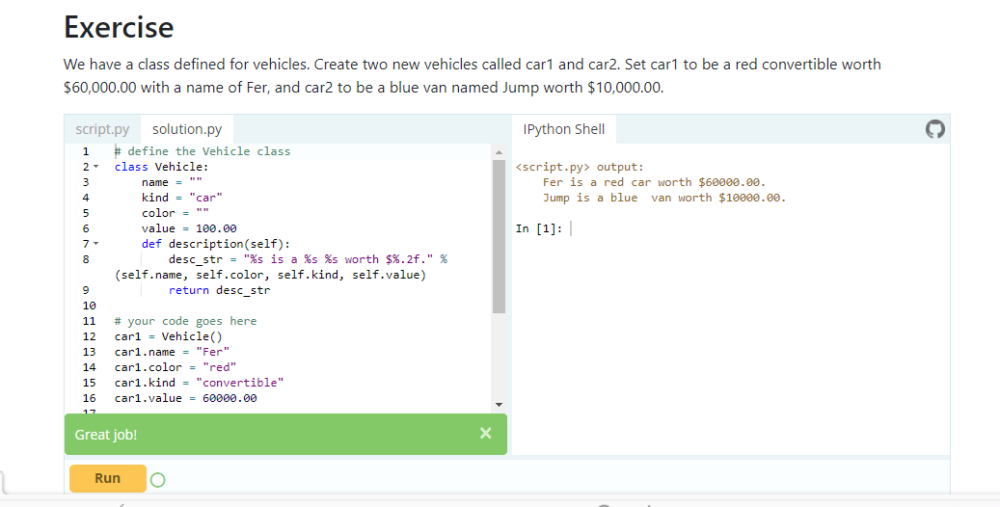
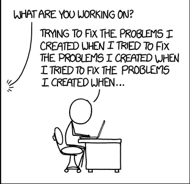

# Classes and Objects
Python is an object oriented programming language.
Almost everything in Python is an object, with its properties and methods.
A Class is like an object constructor, or a "blueprint" for creating objects.

- What is the classes and the objects ? 
Objects are an encapsulation of variables and functions into a single entity. Objects get their variables and functions from classes. Classes are essentially a template to create your objects.
- - 
*  Creat Class with variables
To Create a class named MyClass, with a property named value use class keyword :

class MyClass :
   variable = value
   x = 10

* Create object 
Now we can  use the class named MyClass to create object 

object1 = MyClass()

- Accessing Object Variables 
print (object1.variable) ==> output = value 
print ( object1.x )      ==> output = 10

- Changing the values 
You can create multiple different objects that are of the same class(have the same variables and functions defined)
if we were to define another object with the "MyClass" class and then change the string in the variable above
object2 = MyClass()
object2.x = 20

print (object2.x ) ==> output = 20
print (object1.x)  ==> output = 10 

* Creat Class with functions
    class MyClass:
      def func(self) :
        print ("Hello, World!)

- Accessing Object functions
 object1 = MyClass()
 object1.func()     ==> output = Hello, World!

 - - 
- The examples above are classes and objects in their simplest form, and are not really useful in real life applications.
To understand the meaning of classes we have to understand the built-in __init__() function.

* The __init__() Function
All classes have a function called __init__(), which is always executed when the class is being initiated.

class car :
   def __init__(self , brand ,color):
      self.brand = brand
      self.color = color
p = car("BMW" , "Black")

print (p.brand) ==> output = BMW
print (p.color) ==> output =Black

Note: The __init__() function is called automatically every time the class is being used to create a new object.

### To Practice Try This Excercise at 
[Classes and Objects exercise](https://www.learnpython.org/en/Classes_and_Objects#google_vignette)

# Thinking Recursively

  
<!-- THIS IMAGE TAKEN FROM https://realpython.com/python-thinking-recursively/ -->

Problems (in life and also in computer science) can often seem big and scary. But if we keep chipping away at them, more often than not we can break them down into smaller chunks trivial enough to solve. This is the essence of thinking recursively

## Recursive Functions in Python
A recursive function is a function defined in terms of itself via self-referential expressions.
This means that the function will continue to call itself and repeat its behavior until some condition is met to return a result. All recursive functions share a common structure made up of two parts: base case and recursive case.

- To demonstrate this structure, let’s write a recursive function for calculating n!:
1. Decompose the original problem into simpler instances of the same problem. This is the recursive case:

                                     n! = n x (n−1) x (n−2) x (n−3) ⋅⋅⋅⋅ x 3 x 2 x 1
                                     n! = n x (n−1_!
2. As the large problem is broken down into successively less complex ones, those subproblems must eventually become so simple that they can be solved without further subdivision. This is the base case:
                                     n! = n x (n−1)! 
                                 n! = n x (n−1) x (n−2)!
                             n! = n x (n−1) x (n−2) x (n−3)!
⋅
⋅
                          n! = n x (n−1) x (n−2) x (n−3) ⋅⋅⋅⋅ x 3!
                        n! = n x (n−1) x (n−2) x (n−3) ⋅⋅⋅⋅ x 3 x 2!
                      n! = n x (n−1) x (n−2) x (n−3) ⋅⋅⋅⋅ x 3 x 2 x 1!
 Here, 1! is our base case, and it equals 1.

 Recursive function for calculating n! implemented in Python:
         def factorial_recursive(n):
    # Base case: 1! = 1
    if n == 1:
        return 1

    # Recursive case: n! = n * (n-1)!
    else:
        return n * factorial_recursive(n-1)

## Maintaining State
When dealing with recursive functions, keep in mind that each recursive call has its own execution context, so to maintain state during recursion you have to either:

1. Thread the state through each recursive call so that the current state is part of the current call’s execution context
2. Keep the state in global scope

Example1 : 
def sum_recursive(current_number, accumulated_sum):
    # Base case
    # Return the final state
    if current_number == 11:
        return accumulated_sum

    # Recursive case
    # Thread the state through the recursive call
    else:
        return sum_recursive(current_number + 1, accumulated_sum + current_number)

Example2 : 
     # Global mutable state
     current_number = 1
     accumulated_sum = 0

     def sum_recursive():
      global current_number
      global accumulated_sum
      # Base case
      if current_number == 11:
           return accumulated_sum
           # Recursive case
      else:
            accumulated_sum = accumulated_sum + current_number
            current_number = current_number + 1
           return sum_recursive()

## Recursive Data Structures in Python
A data structure is recursive if it can be defined in terms of a smaller version of itself

Example:

Return a new list that is the result of

 adding element to the head (i.e. front) of input_list

def attach_head(element, input_list):

    return [element] + input_list

    Referrences :
    1. W3school
    2. RealPython.com

                                      

 

